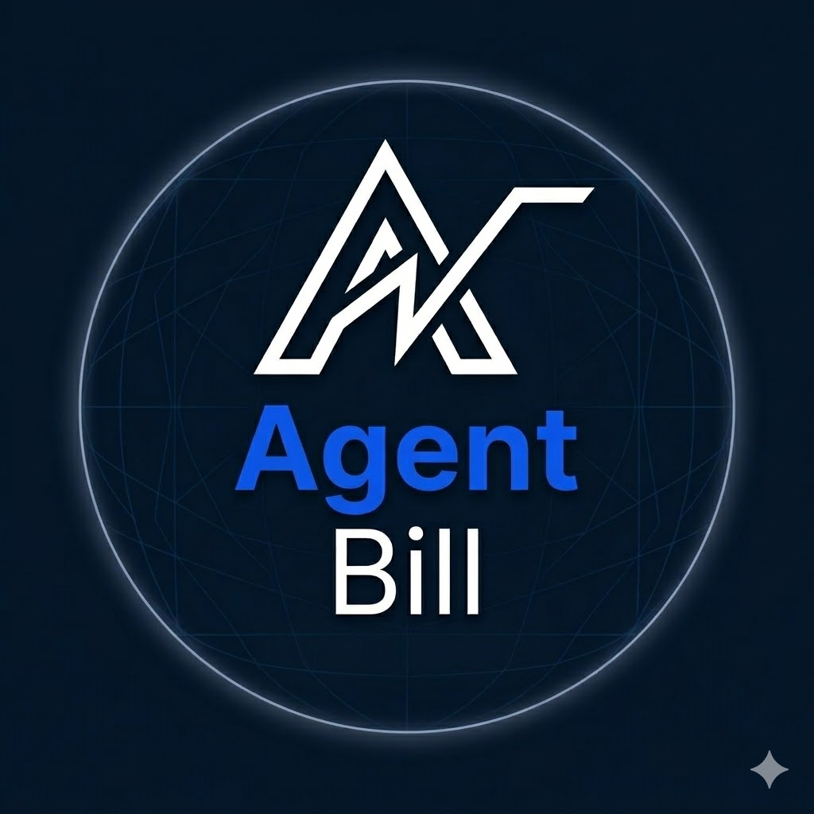

# AgentBill


**The "Stripe" for x402 — make any API payable by an AI agent in two lines of code.**

Built on [Base](https://base.org) · Powered by [x402 V2](https://x402.org) · Settles in USDC

---

## The Problem

The internet is shifting from humans clicking buttons to **AI agents calling APIs**. But most APIs still require a credit card, a monthly subscription, or a complex API key setup that an agent can't navigate.

The **x402 protocol** (by Coinbase) fixes this: a server returns `402 Payment Required` and the agent pays instantly in USDC — no signup, no OAuth, no human in the loop.

**The catch:** wiring up x402 from scratch means configuring resource servers, registering payment schemes, handling CAIP-2 network IDs, and getting the headers right. Most developers won't bother.

AgentBill makes it two lines.

---

## What is AgentBill?

A middleware SDK that wraps x402 V2 so developers can add a payment wall to any Express route with minimal setup.

```typescript
import { agentBill, requirePayment } from "@agent-bill/middleware";

agentBill.init({ receivingAddress: "0xYours", network: "base-sepolia" });

app.get(
  "/api/data",
  requirePayment({ amount: "0.01", currency: "USDC" }),
  handler
);
```

That's it. Your API now accepts USDC payments from any AI agent or x402-compatible client.

---

## How It Works

```
AI Agent                    Your API (AgentBill)         x402.org Facilitator
    │                               │                            │
    │── GET /api/data ─────────────►│                            │
    │◄── 402 + PAYMENT-REQUIRED ────│                            │
    │                               │                            │
    │  [signs payment authorization]│                            │
    │                               │                            │
    │── GET /api/data ──────────────│                            │
    │   + PAYMENT-SIGNATURE header  │── verify ─────────────────►│
    │                               │◄── valid ──────────────────│
    │◄── 200 + data ────────────────│                            │
```

---

## Project Structure

```
agent-bill/
├── packages/
│   └── middleware/        # @agent-bill/middleware — Express + Next.js payment wall
├── examples/
│   └── express-quickstart/  # Runnable demo server + paying test client
└── README.md
```

---

## Getting Started

### Install

```bash
npm install @agent-bill/middleware
```

### Usage

```typescript
import express from "express";
import { agentBill, requirePayment } from "@agent-bill/middleware";

const app = express();

agentBill.init({
  receivingAddress: "0xYourWalletAddress",
  network: "base-sepolia", // or "base-mainnet"
});

app.get(
  "/api/weather",
  requirePayment({
    amount: "0.01",
    currency: "USDC",
    description: "Weather data",
  }),
  (req, res) => {
    res.json({ city: "New York", temp: "72°F" });
  }
);

app.listen(3000);
```

#### Next.js (App Router)

```typescript
// app/api/weather/route.ts
import { withPayment } from "@agent-bill/middleware/next";

async function handler(req: NextRequest) {
  return NextResponse.json({ city: "New York", temp: "72°F" });
}

export const GET = withPayment({ amount: "0.01", currency: "USDC" }, handler);
```

Call `agentBill.init()` once in `instrumentation.ts` before any requests are handled.

See [`packages/middleware/README.md`](packages/middleware/README.md) for full API docs.

---

## Roadmap

- [x] `@agent-bill/middleware` v0.1 — Express payment wall (x402 V2)
- [x] `examples/express-quickstart` — runnable demo server + test client
- [x] `@agent-bill/middleware` — Next.js App Router support (`withPayment`)
- [ ] `examples/agent-client` — demo AI agent that auto-pays
- [ ] Dashboard — payment analytics per endpoint

---

## Why Base?

Base has near-zero gas fees, making micro-transactions (e.g. $0.01) economically viable. AgentBill is designed for the Base ecosystem — settles in USDC, compatible with Coinbase AgentKit and the x402 facilitator out of the box.

---

## License

MIT

---

_AgentBill is not affiliated with Coinbase. x402 is an open protocol._
