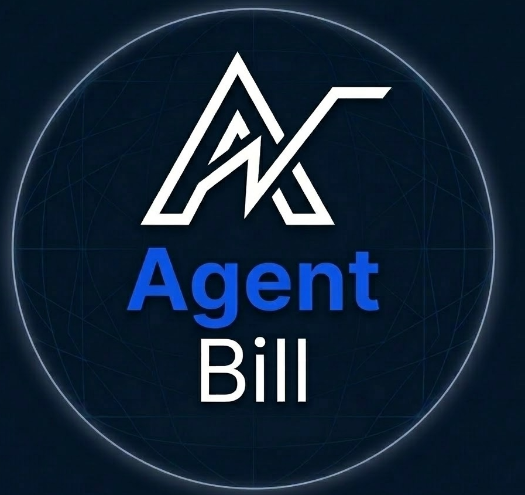
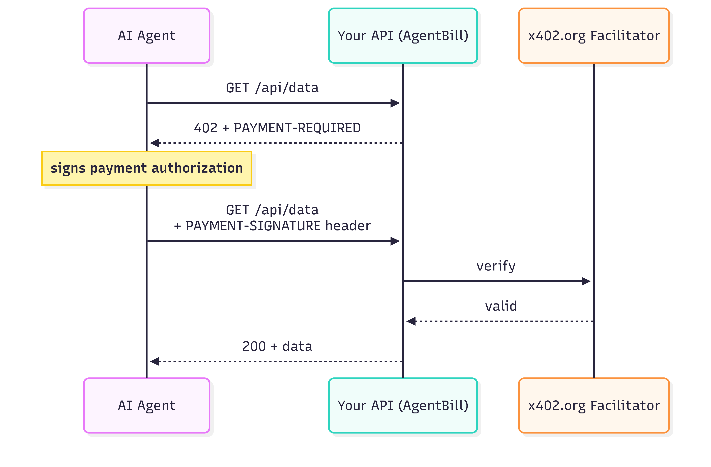

# AgentBill


**The "Stripe" for x402. Make any API payable by an AI agent in two lines of code.**

Built on [Base](https://base.org) · Powered by [x402 V2](https://x402.org) · Settles in USDC · [Website](https://the-agentbill.github.io)

**Live demo:** [agent-billmiddleware-production.up.railway.app](https://agent-billmiddleware-production.up.railway.app/api/weather)
· **Proof of payment:** [Basescan tx](https://basescan.org/tx/0x8be8fc88d7f7fb768315bc4bcd1b438d32b76bfa9ba24a95ed6dacdd2d1224cb)


## The Problem

The internet is shifting from humans clicking buttons to **AI agents calling APIs**. But most APIs still require a credit card, a monthly subscription, or a complex API key setup that an agent can't navigate.

The **x402 protocol** (by Coinbase) fixes this: a server returns `402 Payment Required` and the agent pays instantly in USDC. No signup, no OAuth, no human in the loop.

**The catch:** wiring up x402 from scratch means configuring resource servers, registering payment schemes, handling CAIP-2 network IDs, and getting the headers right. Most developers won't bother.

AgentBill makes it two lines.


## What is AgentBill?

A unified SDK that wraps x402 V2. Use it as a **server** to add payment walls, or as a **client** to auto-pay endpoints.

**Zero platform fees.** Other hosted wrappers take a cut of every transaction. AgentBill is self-hosted — every dollar paid to your API goes directly to your wallet.

```typescript
import { agentBill, requirePayment } from "@agent-bill/sdk";

agentBill.init({ receivingAddress: "0xYours", network: "base-sepolia" });

app.get(
  "/api/data",
  requirePayment({ amount: "0.01", currency: "USDC" }),
  handler
);
```

That's it. Your API now accepts USDC payments from any AI agent or x402-compatible client.


## How It Works




## Getting Started

### Install

```bash
npm install @agent-bill/sdk
```

### Server - Add a Payment Wall (Express)

```typescript
import express from "express";
import { agentBill, requirePayment } from "@agent-bill/sdk";

const app = express();

agentBill.init({
  receivingAddress: "0xYourWalletAddress",
  network: "base-sepolia",
});

app.get(
  "/api/weather",
  requirePayment({
    amount: "0.01",
    currency: "USDC",
    description: "Weather data",
  }),
  (req, res) => {
    res.json({ city: "New York", temp: "72°F" });
  }
);

app.listen(3000);
```

### Client - Auto-Pay for Endpoints

```typescript
import { createPayingClient } from "@agent-bill/sdk";

const client = createPayingClient({
  privateKey: "0xYourWalletPrivateKey",
  network: "base-sepolia",
});

const response = await client.fetch("http://localhost:3000/api/weather");
const data = await response.json();
```

### Server - Hono (Cloudflare Workers, Deno, Bun)

```typescript
import { Hono } from "hono";
import { agentBill } from "@agent-bill/sdk";
import { requirePayment } from "@agent-bill/sdk/hono";

agentBill.init({
  receivingAddress: "0xYourWalletAddress",
  network: "base-sepolia",
});

const app = new Hono();

app.get(
  "/api/weather",
  requirePayment({ amount: "0.01", currency: "USDC", description: "Weather data" }),
  (c) => c.json({ city: "New York", temp: "72°F" })
);

export default app;
```

### Next.js (App Router)

```typescript
// app/api/weather/route.ts
import { agentBill, withPayment } from "@agent-bill/sdk";

// Initialize once (e.g. in instrumentation.ts)
agentBill.init({
  receivingAddress: "0xYourWalletAddress",
  network: "base-sepolia",
});

async function handler(req: NextRequest) {
  return NextResponse.json({ city: "New York", temp: "72°F" });
}

export const GET = withPayment({ amount: "0.01", currency: "USDC" }, handler);
```


### Server - Fastify

```typescript
import Fastify from "fastify";
import { agentBill } from "@agent-bill/sdk";
import { requirePayment } from "@agent-bill/sdk/fastify";

agentBill.init({
  receivingAddress: "0xYourWalletAddress",
  network: "base-sepolia",
});

const app = Fastify();

app.register(requirePayment({ amount: "0.01", currency: "USDC" }), {
  prefix: "/api/weather",
});

app.get("/api/weather", async () => {
  return { city: "New York", temp: "72°F" };
});

app.listen({ port: 3000 });
```

### Dashboard - Payment Analytics

```typescript
import { createDashboard } from "@agent-bill/sdk/dashboard";

app.use(createDashboard());
// Visit /dashboard for a live analytics page
```

Payments are automatically recorded by the Express, Hono, and Fastify adapters. The dashboard shows revenue, top endpoints, top payers, and recent transactions.


## Why Base?

Base has near-zero gas fees, making micro-transactions (e.g. $0.01) economically viable. AgentBill is designed for the Base ecosystem. Settles in USDC, compatible with Coinbase AgentKit and the x402 facilitator out of the box.


## License

MIT


_AgentBill is not affiliated with Coinbase. x402 is an open protocol._
